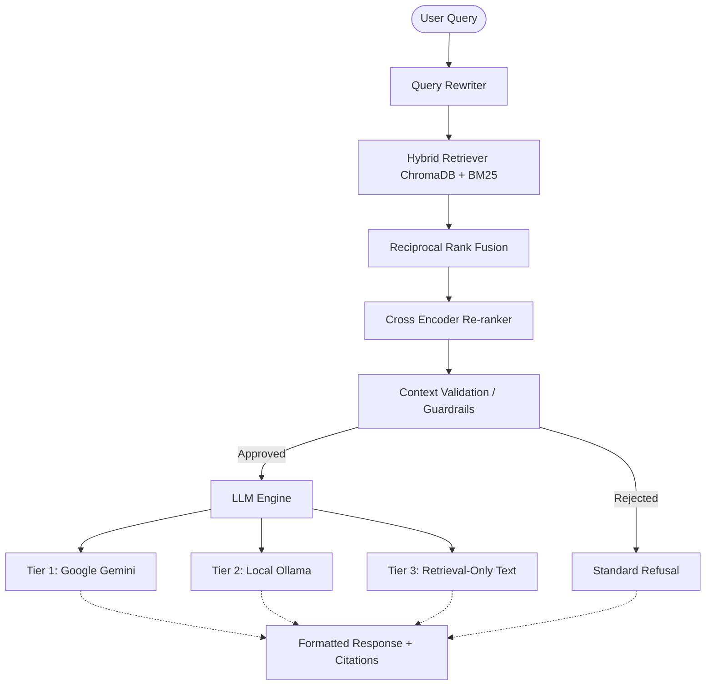

# Enterprise Knowledge Assistant

A production-grade, AI-powered knowledge assistant that can answer user questions based on a given set of enterprise documents using a 3-Tier Fallback Retrieval Augmented Generation (RAG) architecture.

## Project Overview

The Enterprise Knowledge Assistant ingests enterprise documents (PDF, DOCX, TXT, MD), chunks and indexes them using a hybrid semantic and keyword approach, and answers complex queries with full source citations and confidence scores. It is built to be resilient, using local fallback models when external APIs are unavailable.

## Architecture Diagram



## Features

- **Document Ingestion**: Supports uploading and processing PDFs, DOCX, TXT, and Markdown files.
- **Hybrid Retrieval**: Combines ChromaDB (semantic search) and BM25 (keyword search) merged via Reciprocal Rank Fusion (RRF).
- **Cross-Encoder Re-ranking**: Maximizes precision by scoring retrieved chunks directly against the query using a Sigmoid function.
- **Context Guardrails**: Blocks hallucinations by verifying the retrieved context is highly relevant before passing to the LLM.
- **Conversation Memory**: Maintains session context to correctly answer follow-up questions containing pronouns.
- **Tiered Fallback Engine**: Gracefully degrades from Google Gemini to local Ollama (qwen3:8b) to a pure retrieval fallback if LLMs fail.
- **Source Citations & Confidence**: Provides verifiable excerpts and visual confidence indicators for every answer.

## Installation & Setup

1. **Clone the repository** and navigate to the root directory.
2. **Create a virtual environment** and install dependencies:
   ```bash
   python -m venv venv
   source venv/bin/activate  # On Windows: venv\Scripts\activate
   pip install -r requirements.txt
   ```
3. **Set up Environment Variables**: Create a `.env` file in the root directory:
   ```env
   GOOGLE_API_KEY=your_gemini_api_key
   ```
4. **Install local Ollama model** (Optional, for Fallback Tier 2):
   ```bash
   ollama pull qwen3:8b
   ```

## Running Locally

Start the backend FastAPI server:
```bash
python main.py
```
By default, the server runs on `http://0.0.0.0:8000`. The frontend is automatically served at `http://localhost:8000`.

### Health Endpoint
Verify the system status and LLM availability:
```bash
curl http://localhost:8000/api/health
```

### Upload Workflow
Upload documents via the UI or API to ingest them into ChromaDB and BM25.
```bash
curl -X POST -F "file=@sample.pdf" http://localhost:8000/api/upload
```

### Delete Workflow
Delete documents to automatically prune them from all vector and keyword indexes.
```bash
curl -X DELETE http://localhost:8000/api/documents/sample.pdf
```

## Evaluation Framework
Run the built-in enterprise test suite to calculate Precision@5, Recall@5, MRR, and Citation Accuracy metrics:
```bash
python evaluation/evaluate.py
```
This generates a comprehensive `evaluation_report.csv`. There is also a complete E2E testing suite in `test_e2e.py`.

## Known Limitations & Future Improvements
- **Storage**: Currently uses local file-based ChromaDB. In a massive enterprise, this should migrate to a distributed database like Qdrant or Milvus.
- **Memory**: Conversation memory is in-memory only and resets on server restart. Future iterations could persist sessions in Redis.
- **Multi-modality**: Future iterations can parse images inside PDFs using Vision-Language Models.
